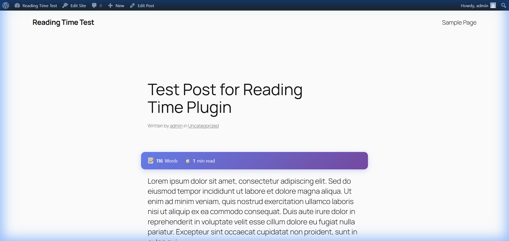
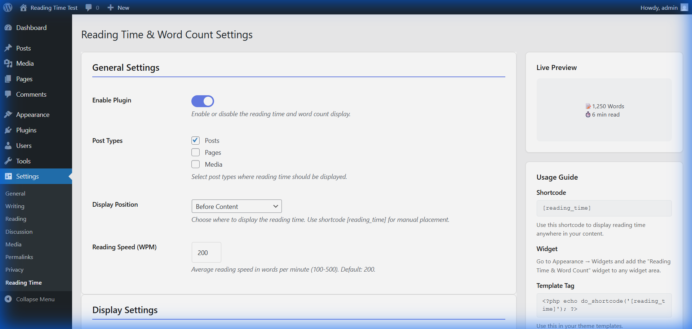
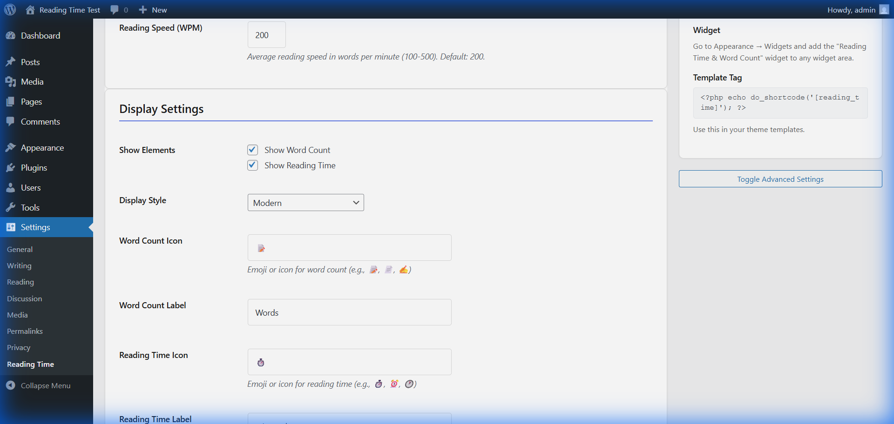

# Reading Time & Word Count


A professional, lightweight WordPress plugin designed to automatically calculate and display reading time and word count for posts. Built with modern aesthetics and comprehensive customization options.

## Key Features

- **Instant Calculation:** Automatic word count and reading time estimation during content rendering.
- **Modern Styles:** Multiple display presets including Modern, Minimal, Badge, and Card styles.
- **Full Customization:** Control over icons, labels, and reading speed (WPM) to align with site branding.
- **Responsive Design:** Optimized for all screen sizes with support for dark mode environments.
- **Flexible Placement:** Options for automatic insertion before or after content, plus shortcode and widget support.
- **Live Preview:** Real-time visualization of changes within the administrative settings dashboard.

---

## Screenshots

### Frontend Display (Modern Style)

*Modern gradient-styled reading time metrics displayed on the frontend.*

### Settings Dashboard

*Plugin configuration panel featuring the integrated live preview system.*

### Display Customization

*Interface for managing visual elements, icons, and custom styling.*

---

## Installation and Setup

### Manual Installation

1. **Upload:** Transfer the `wp-reading-time-word-count` folder to the `/wp-content/plugins/` directory.
2. **Activate:** Navigate to the 'Plugins' menu in the WordPress dashboard and click **Activate**.
3. **Configure:** Access the settings at **Settings → Reading Time** to define preferred display options.

### Usage Options

- **Automatic Display:** The plugin renders automatically on specified post types based on configuration.
- **Shortcode:** Implement `[reading_time]` within post content for manual placement.
- **Widget:** Utilize the "Reading Time & Word Count" widget via **Appearance → Widgets**.
- **Template Tag:** 
  ```php
  <?php echo do_shortcode('[reading_time]'); ?>
  ```

---

## Developer Documentation

The plugin provides filters for advanced customization:

```php
// Custom word count calculation logic
add_filter('rtwc_word_count', function($word_count, $post_id) {
    return $word_count;
}, 10, 2);

// Modify the final HTML output
add_filter('rtwc_display_html', function($html, $post_id, $stats, $settings) {
    return $html;
}, 10, 4);
```

---

## Development and Testing

This repository includes tools to quickly set up a local WordPress environment for testing and development.

### Using Docker (Recommended)

The easiest way to test the plugin is using Docker Compose. This environment pre-installs WordPress and automatically mounts the plugin.

1.  Ensure **Docker Desktop** is running.
2.  Run the follow command in the root directory:
    ```bash
    docker compose up -d
    ```
3.  Access the site at [http://localhost:8080](http://localhost:8080) and complete the WordPress setup.
4.  Activate the plugin via the **Plugins** menu.

### Using Local by Flywheel (Windows)

For developers using Local by Flywheel on Windows, helper scripts are provided in the `tools/` directory.

1.  Create a site in Local named `reading-time-test`.
2.  Run the installation helper:
    ```powershell
    ./tools/check-and-install.ps1
    ```

---

## Security and Standards

- Comprehensive input sanitization and output escaping throughout the codebase.
- Nonce verification for all administrative AJAX requests and form submissions.
- PSR-4 compliant autoloading structure.
- Adherence to WordPress Coding Standards (WPCS).

---

## Author

**Ajay Kumbham**
- Website: [ajaykumbham.vercel.app](https://ajaykumbham.vercel.app)
- GitHub: [@ajaykumbham](https://github.com/ajaykumbham)

---

## License

This project is licensed under the terms of the GNU General Public License v2 or later.